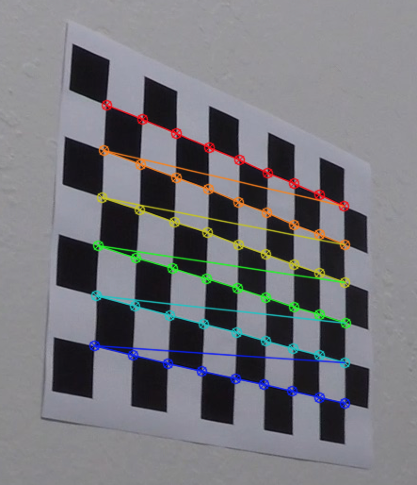
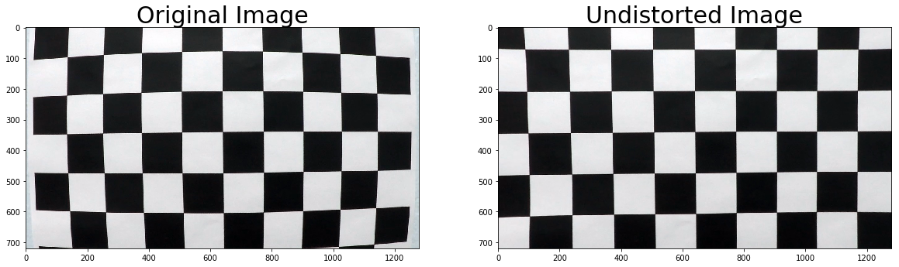
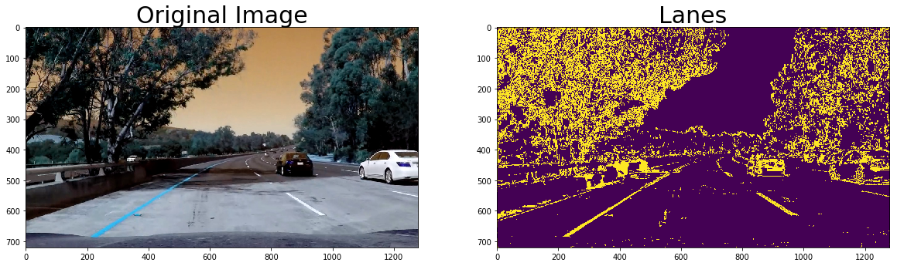
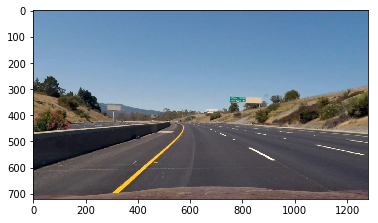
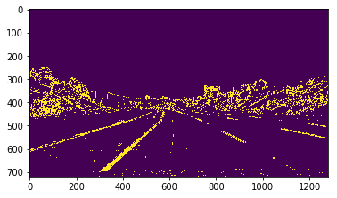
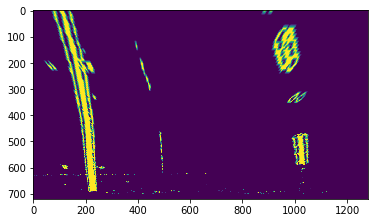
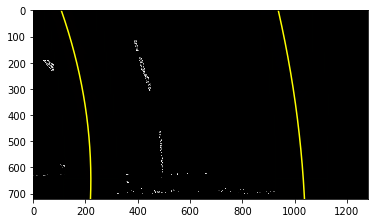
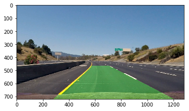

**Advanced Lane Finding Project**

The goals / steps of this project are the following:

* Compute the camera calibration matrix and distortion coefficients given a set of chessboard images.
* Apply a distortion correction to raw images.
* Use color transforms, gradients, etc., to create a thresholded binary image.
* Apply a perspective transform to rectify binary image ("birds-eye view").
* Detect lane pixels and fit to find the lane boundary.
* Determine the curvature of the lane and vehicle position with respect to center.
* Warp the detected lane boundaries back onto the original image.
* Output visual display of the lane boundaries and numerical estimation of lane curvature and vehicle position.

[//]: # (Image References)

[image1]: ./img/chessboard.png "cb"
[image2]: ./test_images/test1.jpg "Road Transformed"
[image3]: ./examples/binary_combo_example.jpg "Binary Example"
[image4]: ./examples/warped_straight_lines.jpg "Warp Example"
[image5]: ./examples/color_fit_lines.jpg "Fit Visual"
[image6]: ./examples/example_output.jpg "Output"
[video1]: ./project_video.mp4 "Video"

## [Rubric](https://review.udacity.com/#!/rubrics/571/view) Points

### Here I will consider the rubric points individually and describe how I addressed each point in my implementation.  

---

### Writeup / README

#### 1. Provide a Writeup / README that includes all the rubric points and how you addressed each one.

You're reading it!

### Camera Calibration

#### 1. Briefly state how you computed the camera matrix and distortion coefficients. Provide an example of a distortion corrected calibration image.

The code for camera calibration is contained in [this notebook](Step 1 - calibrate camera .ipynb). I use the `cv2.findChessboardCorners` method to identify object points (coordinates in the real world) for different corners (`imgpoints`) in the picture.

I then used the `cv2.calibrateCamera()` to calculate the `ret, mtx, dist, rvecs, tvecs` for the camera and stored it in pickle file.



### Pipeline (single images)

#### Provide an example of a distortion-corrected image.

The calibrated coefficients were used to undstort images. For example, on a test image the results look as follows



[Here is the notebook](Step_1_calibrate_camera.ipynb) that I used for camera calibration. I defined functions / classes[here](scripts/calibrate_camera.py) and [here](scripts/distortion_correct.py) that are used in the pipeline. [This notebook](Step_2_distortion_correction.ipynb) has examples. 

#### 2. Describe how (and identify where in your code) you used color transforms, gradients or other methods to create a thresholded binary image.  Provide an example of a binary image result.
[(Notebook)](Step_3_Thresholding.ipynb)

I defined the `ExtractLanes` class [here](scripts/thresholding.py) which uses sobel operators for thresholding along with color operators. 




#### 3. Describe how (and identify where in your code) you performed a perspective transform and provide an example of a transformed image.
[(Notebook)](Step_4_perspective_transform.ipynb)

I used the following coefficients for the perspective transform, using `cv2.getPerspectiveTransform`

```
src = np.float32([[257, 719], [584, 464], [714, 464], [1162, 719]])
dst = np.float32([[200, 700], [200, 0], [1000, 0], [1000, 700]])
```

Original image, after distortion correction



Binary image, after thresholding



Top down view, after perspective transform



#### 4. Describe how (and identify where in your code) you identified lane-line pixels and fit their positions with a polynomial?
[(Notebook)](Step_4_perspective_transform.ipynb)

After the perspective transform, I take a histogram of the lower half of the image


I then do a sliding window search followed by a polynomial fit (2nd degree).



I then warp the perspective back to the original, and get the following output. 



---

---

---


Then I did some other stuff and fit my lane lines with a 2nd order polynomial kinda like this:

![alt text][image5]

#### 5. Describe how (and identify where in your code) you calculated the radius of curvature of the lane and the position of the vehicle with respect to center.

I did this in lines # through # in my code in `my_other_file.py`

#### 6. Provide an example image of your result plotted back down onto the road such that the lane area is identified clearly.

I implemented this step in lines # through # in my code in `yet_another_file.py` in the function `map_lane()`.  Here is an example of my result on a test image:

![alt text][image6]

---

### Pipeline (video)

#### 1. Provide a link to your final video output.  Your pipeline should perform reasonably well on the entire project video (wobbly lines are ok but no catastrophic failures that would cause the car to drive off the road!).

Here's a [link to my video result](./project_video.mp4)

---

### Discussion

#### 1. Briefly discuss any problems / issues you faced in your implementation of this project.  Where will your pipeline likely fail?  What could you do to make it more robust?

Here I'll talk about the approach I took, what techniques I used, what worked and why, where the pipeline might fail and how I might improve it if I were going to pursue this project further.  
