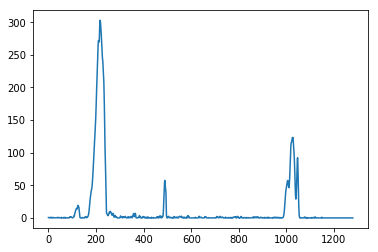
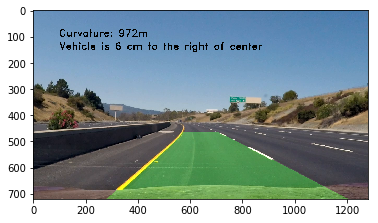

**Advanced Lane Finding Project**

The goals / steps of this project are the following:

* Compute the camera calibration matrix and distortion coefficients given a set of chessboard images.
* Apply a distortion correction to raw images.
* Use color transforms, gradients, etc., to create a thresholded binary image.
* Apply a perspective transform to rectify binary image ("birds-eye view").
* Detect lane pixels and fit to find the lane boundary.
* Determine the curvature of the lane and vehicle position with respect to center.
* Warp the detected lane boundaries back onto the original image.
* Output visual display of the lane boundaries and numerical estimation of lane curvature and vehicle position.

[//]: # (Image References)

[image1]: ./img/chessboard.png "cb"
[image2]: ./test_images/test1.jpg "Road Transformed"
[image3]: ./examples/binary_combo_example.jpg "Binary Example"
[image4]: ./examples/warped_straight_lines.jpg "Warp Example"
[image5]: ./examples/color_fit_lines.jpg "Fit Visual"
[image6]: ./examples/example_output.jpg "Output"
[video1]: ./project_video.mp4 "Video"

## [Rubric](https://review.udacity.com/#!/rubrics/571/view) Points

### Here I will consider the rubric points individually and describe how I addressed each point in my implementation.  

---

### Writeup / README

#### 1. Provide a Writeup / README that includes all the rubric points and how you addressed each one.

You're reading it!

### Camera Calibration

#### 1. Briefly state how you computed the camera matrix and distortion coefficients. Provide an example of a distortion corrected calibration image.

The code for camera calibration is contained in [this notebook](Step 1 - calibrate camera .ipynb). I use the `cv2.findChessboardCorners` method to identify object points (coordinates in the real world) for different corners (`imgpoints`) in the picture.

I then used the `cv2.calibrateCamera()` to calculate the `ret, mtx, dist, rvecs, tvecs` for the camera and stored it in pickle file.


### Pipeline (single images)

#### Provide an example of a distortion-corrected image.

The calibrated coefficients were used to undstort images. For example, on a test image the results look as follows


[Here is the notebook](Step_1_calibrate_camera.ipynb) that I used for camera calibration. I defined functions / classes[here](scripts/calibrate_camera.py) and [here](scripts/distortion_correct.py) that are used in the pipeline. [This notebook](Step_2_distortion_correction.ipynb) has examples. 

#### 2. Describe how (and identify where in your code) you used color transforms, gradients or other methods to create a thresholded binary image.  Provide an example of a binary image result.
[(Notebook)](Step_3_Thresholding.ipynb)

I defined the `ExtractLanes` class [here](scripts/thresholding.py) which uses sobel operators for thresholding along with color operators. 


#### 3. Describe how (and identify where in your code) you performed a perspective transform and provide an example of a transformed image.
[(Notebook)](Step_4_perspective_transform.ipynb)

I used the following coefficients for the perspective transform, using `cv2.getPerspectiveTransform`

```
src = np.float32([[257, 719], [584, 464], [714, 464], [1162, 719]])
dst = np.float32([[200, 700], [200, 0], [1000, 0], [1000, 700]])
```

Original image, after distortion correction


Binary image, after thresholding


Top down view, after perspective transform


#### 4. Describe how (and identify where in your code) you identified lane-line pixels and fit their positions with a polynomial?
[(Notebook)](Step_4_perspective_transform.ipynb)

After the perspective transform, I take a histogram of the lower half of the image



I then do a sliding window search followed by a polynomial fit (2nd degree).


I then warp the perspective back to the original, and get the following output. 


#### 6. Provide an example image of your result plotted back down onto the road such that the lane area is identified clearly.
[(Notebook)](Step_5_smoothing.ipynb)

I wrote up classes for each of the operations in Steps 1 - 4, so that they could be used in the final pipeline. These are in the `scripts/*.py` files. I also added functions to calculate the curvature and the offset from the center based on the ideas described in the lesson.




### Pipeline (video)

#### 1. Provide a link to your final video output.  

Here's a [youtube link to my video result](https://youtu.be/c1HQr1HwNGo). 

[full_pipeline.py](scripts/full_pipeline.py) has all the classes / methods I use to process the video. [(Notebook)](Step_5_smoothing.ipynb)

### Discussion

#### 1. Briefly discuss any problems / issues you faced in your implementation of this project.  Where will your pipeline likely fail?  What could you do to make it more robust?

* The thresholding technique seems like it may / may not work in different light conditions. 
* The smoothing across frames can also be better ( I had to choose the right number of frames to smooth over that worked well here, but it may not generalize)
* Knowledge of the positions and trajectories of other vehicles can be useful to identify lane lines when they are faded out / etc. These can also reinforce the detections by our current pipeline
* I'd love to try out some machine learning methods (neural nets etc.) to identify if a patch of image is a road, and if yes then if it's a lane line or not. 


